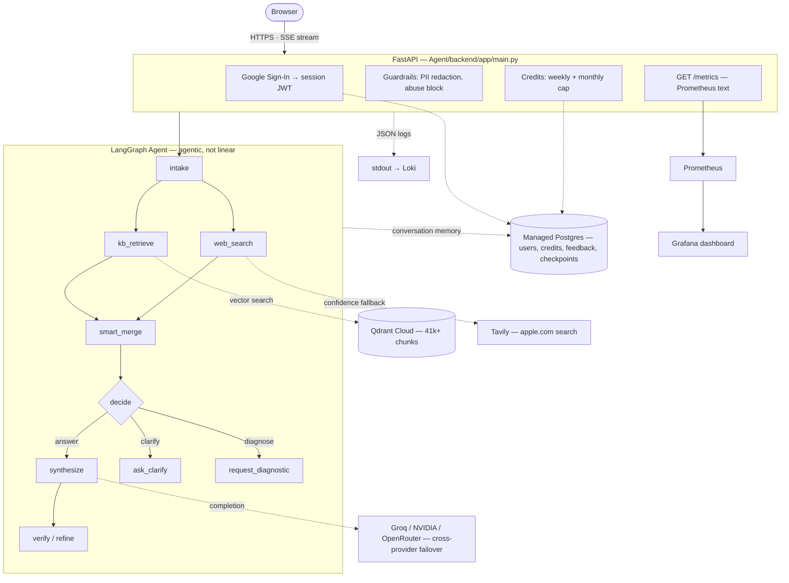

# macOS Troubleshooting RAG System

An agentic RAG system that diagnoses macOS problems better than a frontier model
would — using a smaller open model (Llama-3.3-70B via Groq) backed by a deep,
narrow, well-structured knowledge base.

**Thesis:** on this narrow domain, precise retrieval + solution-depth triage beat
raw model size. Data quality is the product; the model is replaceable.

## Architecture



One database backs everything stateful: `users` / `credit_accounts` /
`usage_log` / `feedback` (Alembic-managed relational schema) **and**, as of
V3, the LangGraph conversation checkpointer itself — so multi-turn memory
(macOS version, chip, already-tried steps, the running case file) survives a
restart or redeploy instead of living only in process RAM. See
[`Agent/backend/app/agent/graph.py`](Agent/backend/app/agent/graph.py)
(`make_memory_checkpointer`) and [`Agent/DEPLOY.md`](Agent/DEPLOY.md).

## v2.0 build — five phases, each shipped and tested independently

| # | Phase | Delivers |
|---|-------|----------|
| 1 | Auth & core engine | Google OAuth → session JWT, Postgres (users), rolling-summary conversation memory |
| 2 | Guardrails & resilience | PII redaction, prompt-abuse blocking, exponential-backoff + quota-aware provider errors |
| 3 | Credits & live status | Weekly (5/user) + monthly ($0.25 cap) credit system backed by exact per-turn token/cost accounting, SSE progress states |
| 4 | Observability, evals, feedback | Prometheus `/metrics`, Grafana dashboard, thumbs up/down feedback, an eval-benchmark regression gate |
| 5 | Deployment | Dockerized service + Alembic migrations-on-boot, `render.yaml` blueprint (web + managed Postgres + cron), smoke tests |

V3 closes the one gap Phase 5 left open — conversation memory now persists in
the same managed Postgres, not an in-process cache.

## Monorepo layout

| Subproject | Path | Role |
|------------|------|------|
| **Ingestion (write path)** | [`vectorDBIngestion/`](vectorDBIngestion/) | Scrape 11 sources → clean/tag → chunk (1 doc = 1 problem-solution) → embed → Qdrant Cloud (41k+ chunks). |
| **Agent (read/serve path)** | [`Agent/`](Agent/) | LangGraph agent + FastAPI (SSE) + marketing landing page + web chat UI + the head-to-head benchmark. |
| **Observability** | [`observability/`](observability/) | Prometheus scrape config + provisioned Grafana dashboard (docker-compose for local use). |

Shared config (`.env`, `pyproject.toml`, `uv.lock`, `.venv`) lives at the root.
See [`CLAUDE.md`](CLAUDE.md) for the full design contract,
[`Agent/README.md`](Agent/README.md) to run the serving layer and benchmark,
and [`Agent/DEPLOY.md`](Agent/DEPLOY.md) for the production deploy runbook.

## Zero-cost production path

The active deployment target is an Oracle Always Free VM running the Docker
stack in [`deploy/oracle/`](deploy/oracle/): Caddy terminates HTTPS, FastAPI is
private, and Grafana Alloy forwards private metrics and Docker logs to Grafana
Cloud. Neon Postgres stores users, credits, feedback, and durable LangGraph
checkpoints. Oracle may reclaim a VM that remains idle; recovery is reproducible
from Git and does not lose Neon state.

## Distinctive features

- **Solution-depth triage** — every KB entry carries a `difficulty_tier`; the
  agent infers what the user has already tried and never leads with the obvious.
- **Multi-turn case file** — macOS version, chip, and already-tried steps
  accumulate across turns, so follow-ups escalate depth instead of restarting.
- **Confidence-gated web fallback** — RAG first; Tavily (scoped to apple.com)
  only when retrieval confidence is low.
- **Head-to-head benchmark** — RAG agent vs raw GPT-4o vs raw Llama-70B, judged
  blind by an independent Claude + Grok panel.

## Web experience

The public root route is a lightweight project landing page with the system
thesis, architecture, checked-in benchmark snapshot, and a live health/metrics
teaser. The actual troubleshooting UI is served at [`/app`](http://localhost:8000/app)
so the marketing surface and the product surface can evolve independently.

The landing page is intentionally static — no frontend build or runtime
service is required. Its architecture view mirrors the Mermaid diagram above;
the operational details remain in [`Agent/DEPLOY.md`](Agent/DEPLOY.md) and
[`observability/README.md`](observability/README.md).

## Quickstart

```bash
cp .env.example .env          # fill in credentials
cd Agent/backend && ../../.venv/bin/uvicorn app.main:app --port 8000
# → http://localhost:8000 (landing page)
# → http://localhost:8000/app (chat)
```
